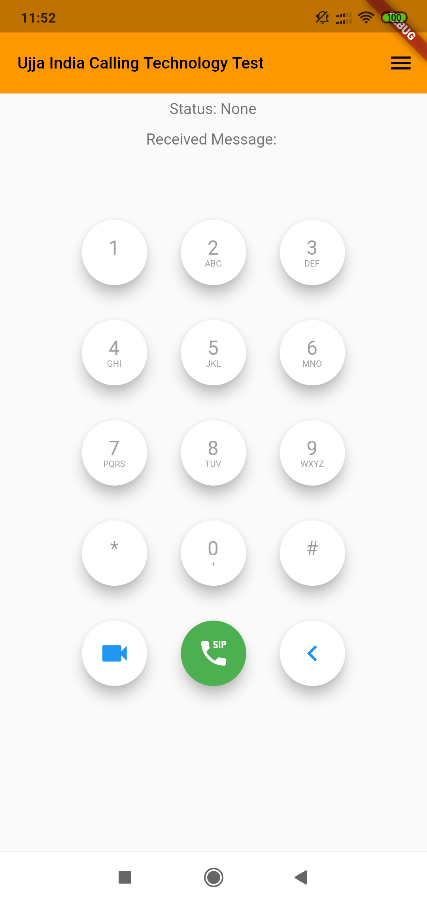
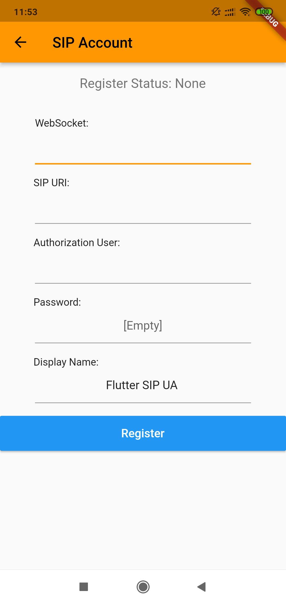

# AppCall

Criação de um App Call

Por enquanto apresenta os seguintes problemas:
 - Acredito que de Buffer, para a ligação ser efetuada é necessário ligar 2x.
 - O pause button funciona só na ativação, quando é preciso desativá-lo não desativa.
 - Se alguém me ligar e eu quiser desligar ele apreseta um erro de que a função não recebe tipo Null.

 Se você já tem um sip funcionando é só registrar e você pode utilizar.

 
 

## Getting Started

Make sure your flutter is using the `dev` channel.

- `flutter channel dev`
- `./scripts/project_tools.sh create`
- `flutter run`

## For Desktop or Web
- `flutter run -d macos`
- `flutter run -d web|chrome`
